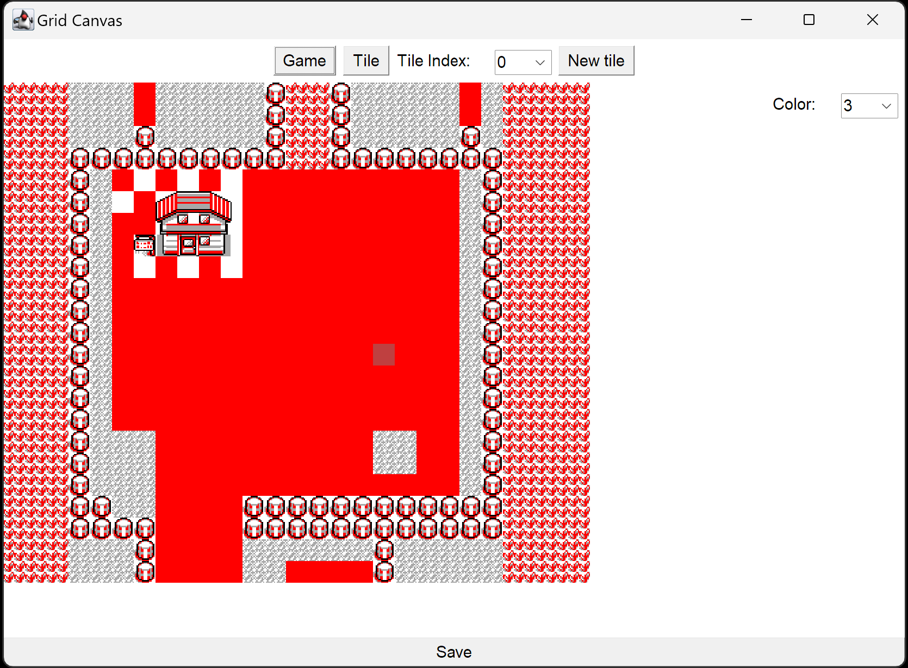
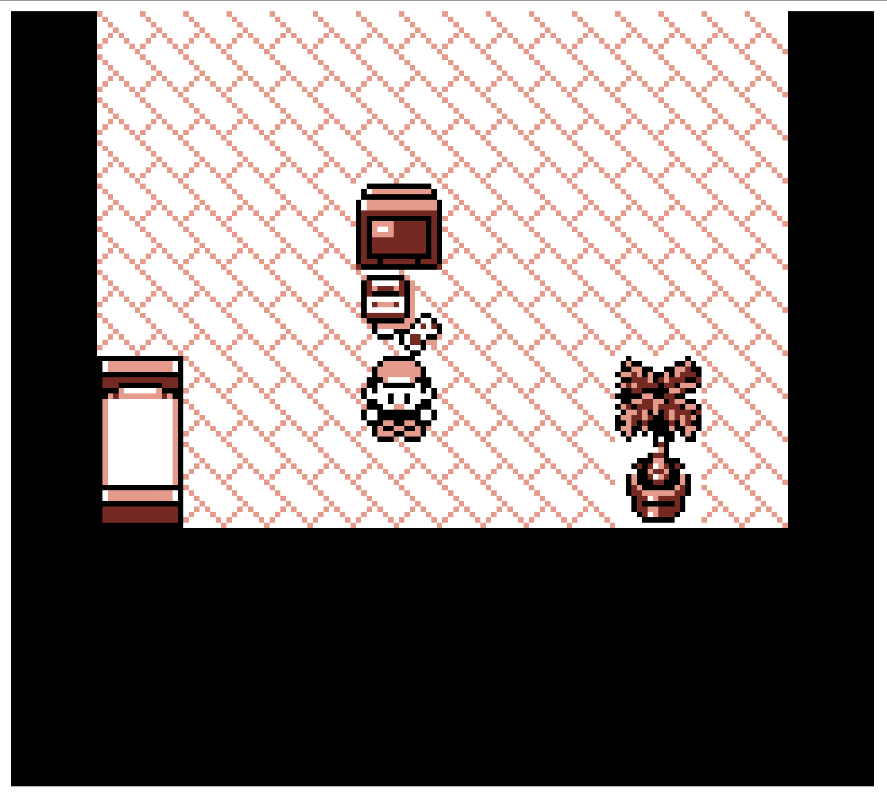

# Poke

(main file is `Application.java`)

Game building engine for top-down mmorpg.
In the example it is used for Pokemon Red (1996) -like game.

## AWT gui

Select tiles to place with `color` switch.
Edit tiles by pressing `Tile` at the top
and selecting `Tile index` to edit.
Tiles 0-3 are reserved for colors (and only these
colors can be used in tiles).

## File system

Sprites and map are persisted in bespoke format
in files `tiles.json` and `map.json`.
They are loaded on start-up and saved with `Save` button.

## Network

Go to [localhost:8000](http://localhost:8000) to
play the game. Map and tiles update without server
restart after pressing `Save`.
